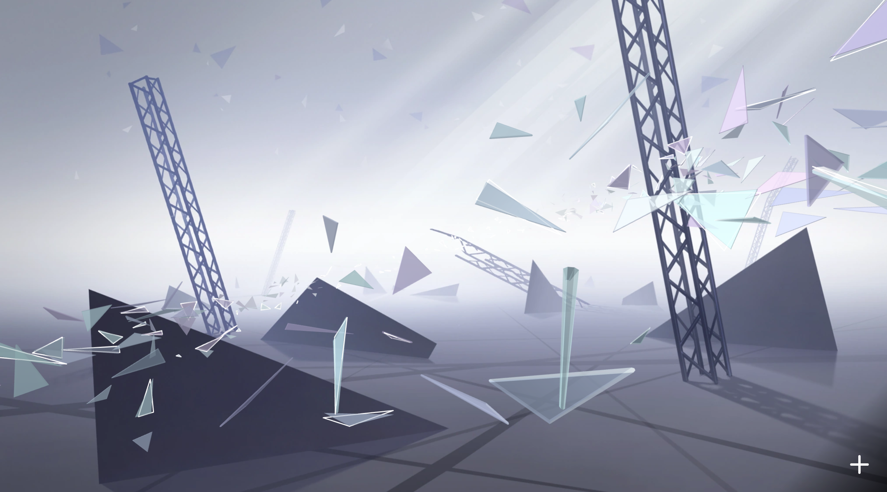
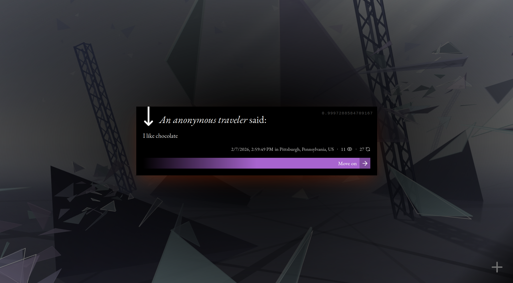

# nightcord.at

[nightcord.at/25](https://nightcord.at/25) is a message-in-a-bottle style, anonymous & asynchronous message board where any visitor gets a unique random selection of past <ruby>messages <rp>(</rp><rt>想いのカケラ</rt><rp>)</rp></ruby> posted to the board. These messages are presented in a 3D landscape of glass fragments, implemented in [Three.js](https://threejs.org).

nightcord.at runs on [Cloudflare Workers Platform](https://worker.dev) and it is possible to spin up at no cost with Workers and D1 free tier. Automated moderation is implemented via the free [OpenAI moderation API](https://platform.openai.com/docs/guides/moderation).

## Running

Make environment variables listed in `.env.example` available.

```sh
pnpm -F shared db:push  # Push schema to the database

pnpm -F public dev      # Run dev environment
pnpm -F public build    # Build application
```

## Screenshots






## Planned

- A manual moderation queue for borderline cases
- Ability for users to flag messages
- Determine fragment colors based on sentiment analysis
- Localization (zh, ja)

## License

This project is provided under [GNU General Public License v3.0 or Later (`GPL-3.0-or-later`)](LICENSE).

---

nightcord.at is an unofficial fanwork of [*Project SEKAI: Colorful Stage! feat. Hatsune Miku*](https://colorfulstage.com/) and its concept is also inspired by [*Arcaea*](https://arcaea.lowiro.com).

[Nightcord at 25:00 (25時、ナイトコードで。)](https://www.sekaipedia.org/wiki/25-ji,_Nightcord_de.) is a music group in *Project SEKAI*.

nightcord.at was a project for [TartanHacks](https://www.tartanhacks.com/) '26.
